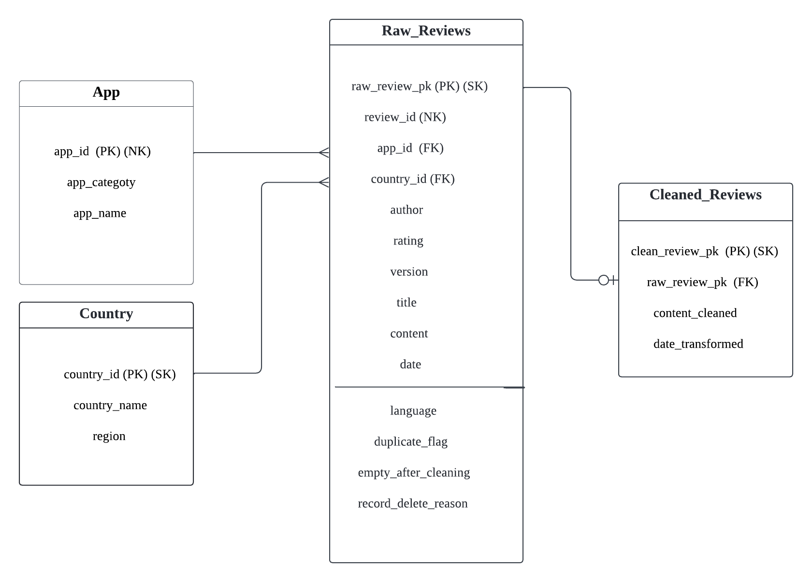

# Database Schema Design

## Entity Relationship Diagram

## Database Design Rationale

### Entity

In order to allow tracing back to the original version of the collected data, we designed the table Raw_Reviews, which stores all attributes directly extracted from the App Store RSS feed, as well as several data quality monitoring attributes. These include ‘duplicate_flag’, which identifies duplicate records, and ‘empty_after_cleaning’, which indicates whether a review becomes empty after the text cleaning process. The auxiliary preprocessing attribute ‘language ’is used to identify how many non-English records should be removed. During the preprocessing process, we dropped many records to maintain a good-quality dataset; therefore, we also added an attribute: ‘record_delete_reason’ for tracking what records were deleted and why they were deleted. Although these attributes are not directly extracted from the RSS feed, they are intentionally stored in the Raw_Reviews table as preprocessing metadata rather than analytical data. This design allows every preprocessing decision to be traced, audited, and reproduced if necessary. 

The Cleaned_Reviews table stores the ‘cleaned content’ attribute, which stores the non-empty review text after preprocessing and serves as the primary input for future sentiment analysis. The attribute ’date_transformed’ stores the datetime format version of the original ’date’ field, enabling time-based filtering and analysis. To reduce data redundancy, attributes that remain unchanged are referenced through the foreign key ‘raw_review_pk’ to the Raw_Reviews table instead of being duplicated in the Cleaned_Reviews table. We separate the cleaned data from the original records to preserve the integrity of the raw dataset while providing an analysis-ready dataset for downstream NLP tasks. 

While reviewing the collected attributes, we found that App and Country each have a one-to-many relationship with review records. In addition, both entities contain additional metadata, and our initial sampling strategy also defined attributes such as ’app_id’, ’app_category’, and ’region’, which were used during sampling but were not directly included in the collected RSS data. Therefore, we separated these attributes into the App and Country tables to reduce data redundancy, avoid update anomalies, and preserve metadata defined in our original sampling design. 

### Key Design

For the Raw_Reviews table, ‘review_id‘ is a natural key extracted from the App Store RSS feed; however, duplicate records may occur due to overlapping web scraping. Therefore, we introduced the surrogate key ’raw_review_pk’ as the primary key to uniquely identify each record. Since each review belongs to one App and one Country, ‘app_id‘ and ‘country_id‘ are used as foreign keys. The App table uses ‘app_id‘ as its natural primary key because it is the unique identifier assigned by the App Store, while the Country table uses the surrogate key country_id to provide a stable identifier and avoid update anomalies. The Cleaned_Reviews table uses ’clean_review_pk’ as its surrogate primary key and ‘raw_review_pk‘ as a foreign key to maintain traceability while avoiding unnecessary duplication of unchanged attributes. 

### Entity Relationship

Unlike the one-to-many relationships between the App and Country tables and Raw_Reviews, each raw review corresponds to at most one cleaned review. Since some raw review records are removed during preprocessing to maintain a high-quality dataset, the relationship between Raw_Reviews and Cleaned_Reviews is 1:0 to 1. 

### Normalization

The schema satisfies the principles of Third Normal Form (3NF) by ensuring that each table represents a single entity, every non-key attribute depends only on the primary key, and transitive dependencies are removed. 

